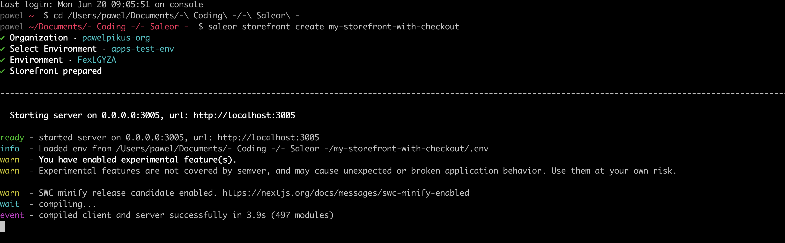
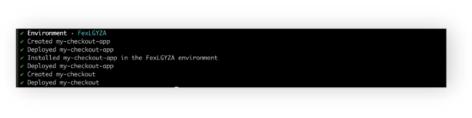
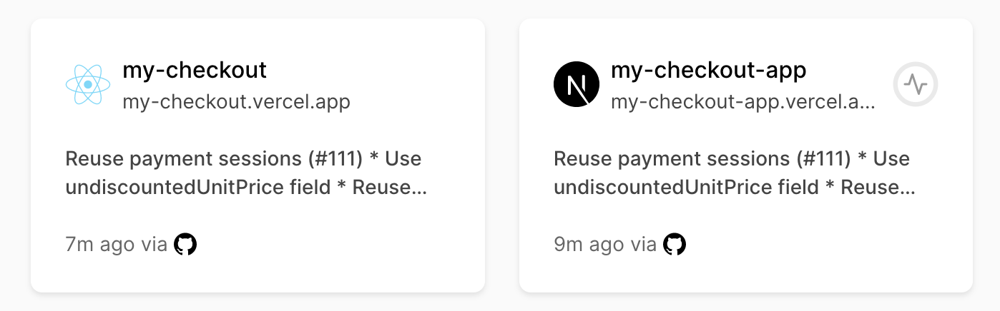
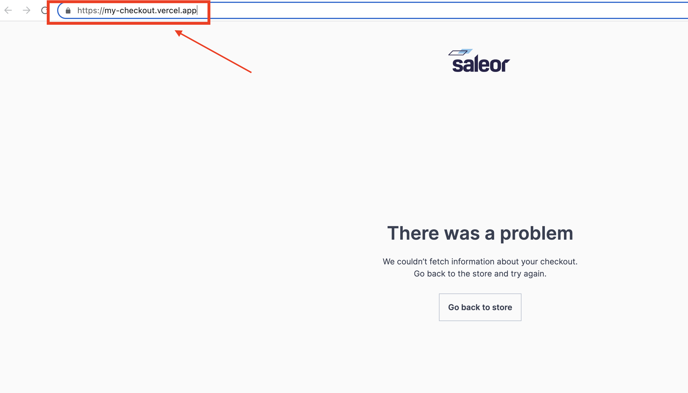

# Integrating Saleor Storefront with Saleor Checkout using CLI

Saleor platform comprises many powerful parts that can be easily combined and integrated using CLI tool. This guide will show you how you can swiftly add Saleor checkout to an existing storefront.

## What will I learn?

After finishing this guide, you'll have accomplished the following:

1. Created a Saleor sample storefront.
2. Deployed Saleor Checkout SPA and Saleor Checkout App to Vercel.
3. Configure Mollie and Adyen payment gateways.

## Prerequisites

In order to be successful with integration you need to integrate CLI with Vercel and Github.
In your Terminal, run:

`saleor vercel login`
`saleor github login`

You will be redirected to dedicated pages where you can finish the integration process.

## Step 1. Creating Saleor Storefront.

You can integrate Saleor Checkout with any existng storefront. Yet, for the simplicity sake let us use a ready-made storefront example provided by Saleor.

1. Open your Terminal in the directory you want to install your storefront.
2. Run

`saleor storefront create my-storefront-with-checkout`

This command will install the Saleor Storefront project called `my-storefront-with-checkout` on your machine and start the local server.

For now, you can stop the server with `CTRL+C`.

## Step 2. Deploying Saleor Checkout SPA and Checkout App. Installing Checkout App in Dashboard.

Thanks to the CLI, the deployment process is very straightforward.

1. Being in your Terminal, type in:
   `saleor checkout deploy my-checkout`

After a while, you will have two apps deployed to Vercel:

- `my-checkout-app` - a Next.js Saleor App installed in Dashboard for managing settings and theme, backend for checkout SPA, ready to be extended/modified
- `my-checkout` - the frontend part - a SPA React 18 project, ready to be extended/modified
  

2. Copy the `url` of your Checkout App from Vercel to `.env` file in your storefront code.
   

Restart the develpment server. Try to go through the process of adding a product to cart. After clicking the Checkout button you'll be redirected to the checkout SPA view.

## Step 3. Configuring payment gateways.

### Mollie

### Adyen

(screenshots from checkout readme)
