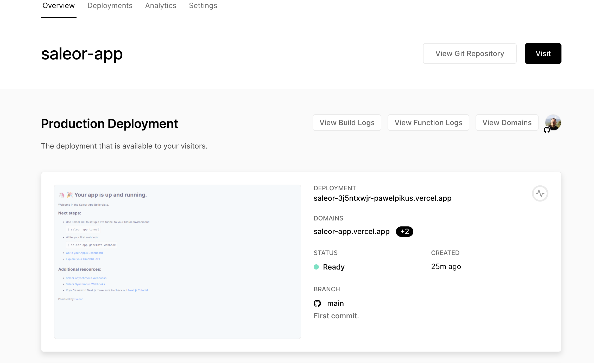

# Deploy your Saleor App to Vercel with Github

## Prerequisites

In order to proceed with the deployment, please make sure you have:

- Registered a Github account.
- Registered a Vercel account (you should authenticate with Github).
- Haved Saleor CLI installed.

## Step 1. Creating a template App.

In your Terminal, go to a directory on your computer you'd like to install the App in and type: `saleor app create [name]`. After a few moments, you'll have your developer environment set up and ready.

## Step 2. Initialize git.

1. `cd` to your App's folder in the Terminal.
2. Run `git init`.

This command will reinitialise a local git repository with your project.

## Step 3. Creating a new remote repository at Github and pushing to remote.

1. In Github.com create a new remote repository and copy/paste the instructions to push an existing local repository to remote.

```
git add .
git commit -m"First commit."
git remote add origin <url-to-your-remote-repo>
git branch -M main
git push -u origin main
```

## Step 4. Deploying to Vercel.

1. In Vercel, click New Project.
2. Choose to Import a Github repository with the name of your App.
3. At the configuration page, override the install command to `pnpm install`.
4. Hit Deploy button.

Your App should be deployed, and you can visit it.

You can also use the url of your deployed App in the process of App installation as described in [Creating Apps with Saleor CLI](#path-to-article).
