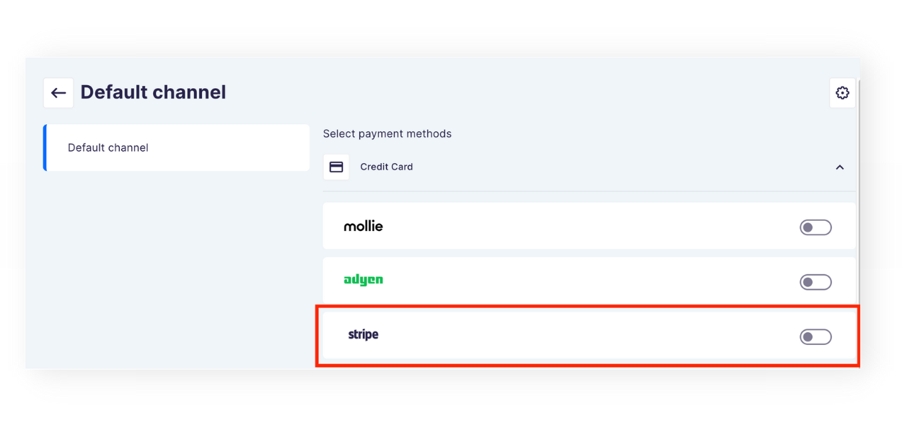
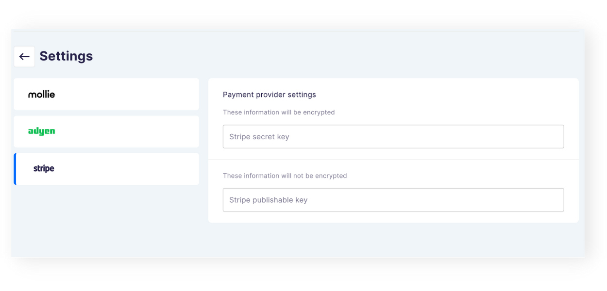

SALEOR VERSION
3.4.9

Saleor Checkout is an extensible, feature-rich checkout powered by Saleor API. It consists of a [CRA](https://create-react-app.dev/) app for connecting Saleor based storefronts with checkout logic and a [Saleor App](https://docs.saleor.io/docs/3.x/developer/extending/apps/key-concepts) for payment gateways configuration and layout customisation of [Saleor Checkout](https://github.com/saleor/saleor-checkout/blob/main/apps/checkout/README.md). This tutorial shows you how to build a custom payment gateway into the Checkout.

## What will I learn?

After finishing this guide, you'll have accomplished the following:

1. Extended Checkout App with the configuration data for Stripe.
2. Extend the Checkout SPA with handlers for Stripe.

## Prerequisites

1. Install [Saleor CLI](./getting-started.md) tool.
2. Configure Checkout App for local development. [Guide here](https://github.com/saleor/saleor-checkout/blob/main/apps/checkout-app/README.md)
3. Configure Checkout SPA for local development. [Guide here](https://github.com/saleor/saleor-checkout/blob/main/apps/checkout/README.md)
4. Create a storefront by using the Saleor Storefront example:

- In your Terminal, go to a folder where you want to install the storefront and type in:
  `saleor storefront create my-storefront-with-checkout`

- in `.env` file in the root of your storefront project, set the `NEXT_PUBLIC_CHECKOUT_URL` environment variable to Saleor Checkout SPA URL (which for local development by default is `localhost:8001`)

5. Optionally, for a better first-touch experience on extending Saleor Checkout you may also go through the guide on [Integrating Saleor Storefront with Saleor Checkout](./checkout-integration.md) before moving forward.
6. Optionally, if you wish to actually provide the credentials for Stripe and test the Checkout, you need to register for a [free test account](https://dashboard.stripe.com/register).

## Part I. Extending the Checkout App.

You'll start extending the Checkout by adding Stripe to the list of payment gateways in the Saleor Checkout App that you have installed in the Dashboard and enabling the possibility to set Stripe's credentials.

### Step 1. Creating the Stripe Icon.

1. Open your Terminal and navigate to `config/fields/icons` folder.
2. Create a new file called `Stripe.tsx`.
3. Copy the below code and paste it into the file.

```tsx
import { ThemeVariant } from "@/checkout-app/types/common";
import { createSvgIcon, SvgIconProps } from "@material-ui/core";
import React from "react";

const StripeIconDark = createSvgIcon(
  <path d="M414 113.4c0-25.6-12.4-45.8-36.1-45.8-23.8 0-38.2 20.2-38.2 45.6 0 30.1 17 45.3 41.4 45.3 11.9 0 20.9-2.7 27.7-6.5v-20c-6.8 3.4-14.6 5.5-24.5 5.5-9.7 0-18.3-3.4-19.4-15.2h48.9c0-1.3.2-6.5.2-8.9zm-49.4-9.5c0-11.3 6.9-16 13.2-16 6.1 0 12.6 4.7 12.6 16h-25.8zM301.1 67.6c-9.8 0-16.1 4.6-19.6 7.8l-1.3-6.2h-22v116.6l25-5.3.1-28.3c3.6 2.6 8.9 6.3 17.7 6.3 17.9 0 34.2-14.4 34.2-46.1-.1-29-16.6-44.8-34.1-44.8zm-6 68.9c-5.9 0-9.4-2.1-11.8-4.7l-.1-37.1c2.6-2.9 6.2-4.9 11.9-4.9 9.1 0 15.4 10.2 15.4 23.3 0 13.4-6.2 23.4-15.4 23.4zM223.8 61.7l25.1-5.4V36l-25.1 5.3zM223.8 69.3h25.1v87.5h-25.1zM196.9 76.7l-1.6-7.4h-21.6v87.5h25V97.5c5.9-7.7 15.9-6.3 19-5.2v-23c-3.2-1.2-14.9-3.4-20.8 7.4zM146.9 47.6l-24.4 5.2-.1 80.1c0 14.8 11.1 25.7 25.9 25.7 8.2 0 14.2-1.5 17.5-3.3V135c-3.2 1.3-19 5.9-19-8.9V90.6h19V69.3h-19l.1-21.7zM79.3 94.7c0-3.9 3.2-5.4 8.5-5.4 7.6 0 17.2 2.3 24.8 6.4V72.2c-8.3-3.3-16.5-4.6-24.8-4.6C67.5 67.6 54 78.2 54 95.9c0 27.6 38 23.2 38 35.1 0 4.6-4 6.1-9.6 6.1-8.3 0-18.9-3.4-27.3-8v23.8c9.3 4 18.7 5.7 27.3 5.7 20.8 0 35.1-10.3 35.1-28.2-.1-29.8-38.2-24.5-38.2-35.7z" />,
  "StripeDark"
);

const StripeIconLight = createSvgIcon(
  <path d="M414 113.4c0-25.6-12.4-45.8-36.1-45.8-23.8 0-38.2 20.2-38.2 45.6 0 30.1 17 45.3 41.4 45.3 11.9 0 20.9-2.7 27.7-6.5v-20c-6.8 3.4-14.6 5.5-24.5 5.5-9.7 0-18.3-3.4-19.4-15.2h48.9c0-1.3.2-6.5.2-8.9zm-49.4-9.5c0-11.3 6.9-16 13.2-16 6.1 0 12.6 4.7 12.6 16h-25.8zM301.1 67.6c-9.8 0-16.1 4.6-19.6 7.8l-1.3-6.2h-22v116.6l25-5.3.1-28.3c3.6 2.6 8.9 6.3 17.7 6.3 17.9 0 34.2-14.4 34.2-46.1-.1-29-16.6-44.8-34.1-44.8zm-6 68.9c-5.9 0-9.4-2.1-11.8-4.7l-.1-37.1c2.6-2.9 6.2-4.9 11.9-4.9 9.1 0 15.4 10.2 15.4 23.3 0 13.4-6.2 23.4-15.4 23.4zM223.8 61.7l25.1-5.4V36l-25.1 5.3zM223.8 69.3h25.1v87.5h-25.1zM196.9 76.7l-1.6-7.4h-21.6v87.5h25V97.5c5.9-7.7 15.9-6.3 19-5.2v-23c-3.2-1.2-14.9-3.4-20.8 7.4zM146.9 47.6l-24.4 5.2-.1 80.1c0 14.8 11.1 25.7 25.9 25.7 8.2 0 14.2-1.5 17.5-3.3V135c-3.2 1.3-19 5.9-19-8.9V90.6h19V69.3h-19l.1-21.7zM79.3 94.7c0-3.9 3.2-5.4 8.5-5.4 7.6 0 17.2 2.3 24.8 6.4V72.2c-8.3-3.3-16.5-4.6-24.8-4.6C67.5 67.6 54 78.2 54 95.9c0 27.6 38 23.2 38 35.1 0 4.6-4 6.1-9.6 6.1-8.3 0-18.9-3.4-27.3-8v23.8c9.3 4 18.7 5.7 27.3 5.7 20.8 0 35.1-10.3 35.1-28.2-.1-29.8-38.2-24.5-38.2-35.7z" />,
  "StripeLight"
);

interface StripeProps extends SvgIconProps {
  variant?: ThemeVariant;
}

// TODO: variant should be read from theme when app-bridge will support it
const Stripe = ({ variant = "dark", ...props }: StripeProps) =>
  variant === "dark" ? (
    <StripeIconDark {...props} viewBox="0 0 468 222.5" />
  ) : (
    <StripeIconLight {...props} viewBox="0 0 468 222.5" />
  );

export default Stripe;
```

### Step 2. Setting types for Stripe.

1. Got to `types/common.ts` file and add the payment provider setting types for Stripe to the existing code.

```tsx
export type PaymentProviderID = "mollie" | "adyen" | "stripe";
export type MollieProviderSettingID = "profileId" | "apiKey";
export type AdyenProviderSettingID =
  | "merchantAccount"
  | "hmac"
  | "username"
  | "password"
  | "apiKey"
  | "clientKey";
export type StripeProviderSettingID = "publishableKey" | "secretKey";

export type PaymentProviderSettingID<P extends PaymentProviderID> =
  P extends "mollie"
    ? MollieProviderSettingID
    : P extends "adyen"
    ? AdyenProviderSettingID
    : P extends "stripe"
    ? StripeProviderSettingID
    : never;
```

2. Go to `types/api/pay.ts` and extend the existing code with the types below:

```tsx
type StripeResponse = {
  provider: "stripe";
  data: {
    paymentUrl: string;
  };
};

export type PayRequestSuccessResponse = {
  provider: PaymentProviderID;
  ok: true;
  orderId: string;
} & (MollieResponse | AdyenResponse | StripeResponse);
```

### Step 3. Adding Stripe to the config files.

1. Go to `config/fields/messages/paymentProviders.ts` file and add the payment provider messages for Stripe to the existing code.

```tsx
export const paymentProvidersMessages = defineMessages<PaymentProviderID>({
  mollie: {
    defaultMessage: "Mollie",
    description: "payment provider",
  },
  adyen: {
    defaultMessage: "Adyen",
    description: "payment provider",
  },
  stripe: {
    defaultMessage: "Stripe",
    description: "payment provider",
  },
});

export const stripePaymentProviderMessages =
  defineMessages<StripeProviderSettingID>({
    publishableKey: {
      defaultMessage: "Stripe publishable key",
      description: "payment provider setting",
    },
    secretKey: {
      defaultMessage: "Stripe secret key",
      description: "payment provider setting",
    },
  });
```

2. Navigate to `config/defaults.ts` and add Stripe to the default settings.

```tsx
export const defaultPaymentProviderSettings: PaymentProviderSettingsValues<"unencrypted"> =
  {
    mollie: {
      apiKey: "",
      profileId: "",
    },
    adyen: {
      merchantAccount: "",
      clientKey: "",
      apiKey: "",
      hmac: "",
      password: "",
      username: "",
    },
    stripe: {
      publishableKey: "",
      secretKey: "",
    },
  };
```

3. Go to `config/fields.ts` file and add the `stripePaymentProvider` object to the existing objects.

```tsx
const stripePaymentProvider: Omit<
  PaymentProviderSettings<"stripe">,
  "label"
>[] = [
  {
    id: "publishableKey",
    type: "string",
    encrypt: false,
  },
  {
    id: "secretKey",
    type: "string",
    encrypt: true,
  },
];
```

### Step 4. Testing the integration.

After going through these steps you may inspect the Checkout App in your Dashboard. You should see Stripe added to the list of payment gateways at the Settings page. Also, you'll be able to set the credentials for Stripe at the Config page.
You can read more about setting up payment gateways credentials in [Integrating Saleor Storefront with Saleor Checkout](./checkout-integration.md) guide.



